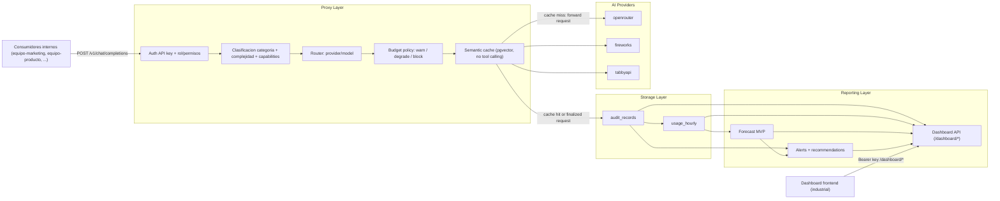

# AI FinOps Proxy — Cost-Control Layer for AI

**AI FinOps Proxy** is an OpenAI-compatible reverse proxy that sits between internal
consumers (teams) and multiple AI providers. It intercepts every `/v1/chat/completions`
call transparently, **routes** each request to the configured provider/model for its
task, reuses recent equivalent prompts through a **pgvector semantic cache**, **records**
the exact token usage and cost per request, **enforces** per-consumer budgets
(warn → degrade → block), **audits** everything, **forecasts** future spend, and serves
an operational **dashboard**. Provider API keys live only inside the proxy — the
consumers that call it never see them. It answers the four AI-FinOps questions: *who*
spends, *what* each request costs, *when* to intervene, and *why* a model choice is
justified.

> **Team project:** I developed this hackathon project as part of a team.

This repo contains a **backend** (FastAPI proxy + Postgres) and a **frontend** (React
dashboard) that together satisfy the full challenge rubric. The default demo uses real
OpenAI-compatible providers (`MOCK_PROVIDERS=false`); an explicit mock mode is available
for dry runs without provider access.

- Backend details: [`backend/README.md`](backend/README.md)
- Frontend details: [`frontend/README.md`](frontend/README.md)
- Shared API contract: [`API_CONTRACT.md`](API_CONTRACT.md)
- Challenge spec / rubric: [`material/CHALLENGE.es.md`](material/CHALLENGE.es.md)
- **Acceptance-criteria evidence:** [`VERIFICATION.md`](VERIFICATION.md)

---

## Architecture (Pilar 4 — separation of concerns)

Three layers: **proxy** (interception / routing / control), **storage** (audit + hourly
aggregates) and **reporting** (dashboard API, forecast, alerts). Provider keys live only
in the proxy layer.



**Provider-agnostic:** providers are OpenAI-compatible endpoints declared in
`backend/config/providers.yaml`; routeable exact model names, prices and capabilities live
in `backend/config/provider_models.yaml`. Bearer keys are injected server-side from
`api_key_env`, so consumers never see provider credentials.

---

## Quickstart (one command)

**Prerequisites:** Docker, [`uv`](https://docs.astral.sh/uv/), `pnpm` + Node 20+, and `jq`
(for the smoke test). Postgres runs in Docker; nothing else needs a system install.

```bash
# from the repo root
cp backend/.env.example backend/.env
# edit backend/.env with OPENROUTER_API_KEY, FIREWORKS_API_KEY and TABBY_API_KEY
go-task demo-up
```

That single target: starts Postgres (Docker) → applies Alembic migrations → seeds ~7 days
of multi-provider demo data (~1130 requests with a workday pattern) → starts the
**backend proxy on :8000** in real-provider mode (`MOCK_PROVIDERS=false` by default) →
starts the **frontend dashboard on :5173** pointed at the backend → starts the two
**OpenWebUI demo instances**. To run without provider access, prefix with the env var:
`MOCK_PROVIDERS=true go-task demo-up` (or `MOCK_PROVIDERS=true make demo-up`).

Then open:

| URL | What |
|---|---|
| **http://localhost:5173** | Dashboard (sign in with a key below) |
| **http://localhost:5173/pitch** | Integrated 5-minute product presentation (admin sign-in required) |
| **http://localhost:5173/pitch?setup=1** | Presentation preflight and demo safety controls |
| http://localhost:8080 | OpenWebUI admin (`admin@finops.local` / `finops1234`) |
| http://localhost:8081 | OpenWebUI marketing (`marketing@finops.local` / `finops1234`) |
| http://localhost:8000/docs | Backend OpenAPI docs |
| http://localhost:8000/health | Health check |

**Demo API keys** (`Authorization: Bearer <key>`):

| Key | Consumer | Role |
|---|---|---|
| `finops_key_marketing` | equipo-marketing | consumer |
| `finops_key_producto` | equipo-producto | consumer |
| `finops_key_atencion` | equipo-atencion-cliente | consumer |
| `finops_key_admin` | admin | admin (sees all) |

Stop everything with `go-task demo-down`. Re-run the acceptance smoke test any time with
`go-task verify`. Run `go-task --list` for all public demo tasks.

### Integrated hackathon presentation

`/pitch` is a fullscreen React route inside the existing frontend, rendered outside the
dashboard `AppShell`. Sign in with an **admin key** (for the local seed,
`finops_key_admin`) and open `http://localhost:5173/pitch?setup=1`. The administrative
session continues to read summary, requests, budgets, alerts and savings. A separate
**consumer key** is entered in preflight and is used only for `POST /v1/chat/completions`;
it remains in React memory, is masked after validation and is never written to
`localStorage` or `sessionStorage`.

The presentation offers three explicit levels:

- **Safe backend (recommended):** start with
  `MOCK_PROVIDERS=true go-task demo-up`. Routing, budgets, Postgres audit, alerts,
  savings and semantic cache remain real; only upstream provider completions are
  simulated.
- **Live:** use `go-task demo-up` with the provider credentials from `backend/.env`.
- **Frontend rehearsal:** run `VITE_USE_MOCKS=true go-task demo-up` (or, for the
  frontend alone, `cd frontend && VITE_USE_MOCKS=true pnpm dev`). Routing, budget and
  cache demos use deterministic mutable in-memory fixtures and are labelled **DEMO DATA**.

Known consumer-key shortcuts are visible automatically in Vite development. For a
non-development rehearsal build, opt in explicitly with `VITE_ENABLE_DEMO_KEYS=true`.
Normal production builds do not reveal these shortcuts. If Internet access fails, use
Safe backend mode; if the backend itself is unavailable, restart the frontend with
`VITE_USE_MOCKS=true` and use Frontend rehearsal.

Run preflight before presenting. It verifies the admin session, backend health,
summary, audit, budgets, savings, alerts, the consumer key and `/v1/models`, and reports
whether backend providers are simulated. Budget-demo changes are never automatic. A
bright **Restore original budget** control returns the exact captured limit and warning
threshold; restore it before leaving the slide. Preflight also exposes any pending
restore.

Keyboard controls: `→`, `Page Down` or `Space` advances; `←` or `Page Up` goes back;
`Home`/`End` jumps to the first/last slide; `N` toggles presenter notes; `Esc` closes a
panel, exits fullscreen or returns to the dashboard; the fullscreen control is in the
bottom toolbar. Navigation keys are ignored while focus is in a form control. Horizontal
swipe provides basic touch navigation, and the active slide is restored from
`#slide-N`.

A five-minute sequence is: opening (0:20), problem (0:25), architecture (0:30), routing
demo (1:00), budget demo including restore (1:05), cache demo with exact replay (0:55),
live savings (0:30), close (0:15). Presenter notes include a failure fallback for every
slide.

> No `go-task` installed? The Makefile is a minimal fallback with the same public commands:
> `make demo-up`, `make demo-down`, `make status`, `make logs`, `make verify`.

### Demo mode

```bash
go-task demo-up
```

The demo runs the backend with `MOCK_PROVIDERS=false` so OpenWebUI can show genuine model
text and the dashboard can show the real request cost. Put provider credentials in
`backend/.env` as `OPENROUTER_API_KEY`, `FIREWORKS_API_KEY` and `TABBY_API_KEY`. For local
real-model demos, point `tabbyapi` at `http://127.0.0.1:5000/v1` and load the exact model
configured in `provider_models.yaml` (for example `gemma-4-12B-it-exl3`).

### Recommended flow

1. **Start everything** with `go-task demo-up`.
2. **Dashboard walk-through** at `http://localhost:5173`: cover routing, per-consumer spend,
   budgets, alerts, forecast and degradation.
3. **Authenticity path**: send
   a real chat via **marketing OpenWebUI (`:8081`)** — the judges see genuine model text
   *and* watch the real cost land in the dashboard (`/dashboard/usage/requests`, `/summary`).

### OpenWebUI demo setup (`:8080` / `:8081`) — 1 message = 1 proxy request

OpenWebUI, by default, fires **several extra LLM calls per user message** (chat-title
generation, follow-up suggestions, tag generation, autocomplete, and search/retrieval
query rewriting). Each of those hits the proxy as its own `/v1/chat/completions`, inflating
the audit trail so a single question shows up as 3–5 billed rows. For a clean demo we
disable them so **one OpenWebUI message == exactly one proxy request**.

OpenWebUI uses one OpenAI API key per instance, not per OpenWebUI login. The demo therefore
uses two isolated instances with separate named volumes. `go-task demo-up` starts both:

Both instances point OpenWebUI at the
proxy through `http://host.docker.internal:8000/v1`, mount a named volume, and disable the
auxiliary generations via environment variables.

```text
Admin instance:
  http://localhost:8080
  admin@finops.local / finops1234

Marketing instance:
  http://localhost:8081
  marketing@finops.local / finops1234
```

In the admin instance, `/v1/models` exposes `auto` plus the full provider/model catalog. In
the marketing instance, `/v1/models` exposes only `auto`, and every request is recorded under
`equipo-marketing`.

Verify the quieting worked — one message should add exactly one row to
`GET /dashboard/usage/requests?consumer=equipo-marketing` when using the marketing instance.
You can confirm the flags are off via `GET /api/v1/tasks/config`
(all `ENABLE_*_GENERATION` should be `false`).

> The `ENABLE_*_GENERATION` flags are OpenWebUI *PersistentConfig* values: the env vars set
> the initial value on a **fresh** data volume. If you reuse an existing volume where they
> were already enabled, toggle them off in **Admin Settings → Interface** (or via
> `POST /api/v1/tasks/config/update`) instead.

---

## Demo script (map to the 6 acceptance criteria)

Sign in at http://localhost:5173. Have `go-task verify` output on a second screen — it proves
every point below with live numbers.

1. **Interception + intelligent routing across ≥2 providers.**
   In the app (as `finops_key_marketing`) send prompts of different kinds via **Overview →
   playground / or** show the **Requests** page. Point out that `model=auto` requests are
   classified by *category* (`misc`, `code_generation`, `web_search`, `qa_internal`) and
   *complexity tier*, and land on different `selected_provider` / `selected_model`
   combinations. Evidence in Requests: provider/model columns differ per row.

2. **Token usage + cost recorded per request.**
   Open any row on **Requests** → the detail shows `actual_prompt_tokens`,
   `actual_output_tokens` and `actual_model_cost`.
   When a judge asks "how much did that cost?", expand the row.

3. **≥2 consumers, each with its own spend history.**
   On **Consumers** (admin) show the three seeded teams with *differentiated* spend.
   The seed auto-scales budgets so marketing sits in the ~84% warning band; producto
   and atención sit lower. Each has its own audit trail and budget.

4. **Configurable budget → visible block / alert / degrade.**
   On **Budgets** (admin) lower `equipo-marketing` below its current spend and save. Send a
   marketing request → the proxy returns **HTTP 429 `budget_exceeded`** and the **Alerts**
   page shows `request_blocked` + `budget_exceeded` (critical). Above the 80% warning band,
   eligible requests are instead **degraded by exactly one tier** to a cheaper model (amber
   rows on Requests).

5. **The 2 explicit cost-saving criteria (Pilar 3).**
   On **Requests**, filter `budget_action = degraded`: the row shows the chosen cheaper
   model vs the `baseline_model` and the `estimated_savings` / ratio. **Overview**
   and **Consumers** surface the aggregate `total_savings`. See the two
   criteria and the cost/quality trade-off below.

6. **Live demo.** Everything above is against the running stack; `go-task verify` re-proves it
   on demand.

---

## Cost-saving decision criteria (Pilar 3)

Every `model="auto"` request flows through:
`category → complexity tier → configured/catalog provider model → capability filter → budget policy
→ selected_provider + selected_model`.

**Criterion 1 — Route each task to the cheapest *compatible* tier for its complexity.**
A request is classified into a category (`qa_internal`, `web_search`, `code_generation`,
`misc`) and a complexity tier (`low`/`medium`/`high`) from prompt length, category,
conversation depth and consumer. Low-complexity `misc`/`qa` tasks land on the cheapest
compatible provider/model, while high-complexity `code_generation`/`qa_internal`
keep a high-quality tier. A **capability filter**
guarantees the chosen model can still do the job (tool_calling, structured_outputs,
web_search, vision); if nothing fits → `no_compatible_model` (400).

**Criterion 2 — Degrade by exactly ONE tier, only under budget pressure *and* with
material savings.** When `current_spend / budget ≥ 0.80` the proxy looks for the model
**one tier below** the baseline **in the same category** (`high → medium`, `medium → low`)
that still satisfies the request's required capabilities, and degrades only if
`estimated_savings_ratio ≥ 25%` (`MIN_DEGRADATION_SAVINGS`). Degradation is **bounded to a
single tier jump**: if the one-tier-lower model doesn't exist, isn't capability-compatible,
or fails the 25% savings gate, the proxy **does not skip to a further tier** — it falls
back to `warn_only` and keeps the baseline. If the request itself would break the budget
(`current_spend + estimated_charge > budget`) it is **blocked** (`429 budget_exceeded`).
Constants: `WARNING_THRESHOLD = 0.80`, `MIN_DEGRADATION_SAVINGS = 0.25`,
`EXPENSIVE_REQUEST_THRESHOLD = $0.01`, `COST_SPIKE_MULTIPLIER = 3.0`.

**Cost/quality trade-off.** The tier assignment (`low`, `medium`, `high`) is the local
routing signal for cost/quality. Because degradation drops **at most one tier** and never
leaves the task category or drops a required capability (`tool_calling`,
`structured_outputs`, `web_search`, `vision`), the accepted quality loss is bounded to a
single-tier change and the task is always still performable. The most quality-sensitive
work (`code_generation` / `qa_internal` high) is only degraded under budget pressure,
never by default. Every
degradation records `baseline_model`, `baseline_model_cost`, `estimated_savings`
and `estimated_savings_ratio` on the audit row, and `total_savings` is surfaced on the
dashboard — the "criteria applied to real usage data" evidence the rubric asks for.

---

## Security note (Pilar 4)

- **Provider keys never leave the proxy.** Consumers authenticate to the proxy with an
  internal FinOps key; the proxy holds the optional provider credentials
  (`OPENROUTER_API_KEY`, `FIREWORKS_API_KEY`, `TABBY_API_KEY`, provider base URLs) in config
  and injects them server-side. A consumer never sees or sends a provider key.
- **Scope isolation is enforced server-side.** A consumer key can only read its own data;
  requesting another consumer returns `403 forbidden_scope` (verified). Only `admin` can
  view all consumers or mutate budgets. Missing/invalid keys return `401`.
- The authenticated admin key uses the existing in-memory/sessionStorage session (never
  `localStorage`). The presentation's consumer key is stricter: **memory only**, never
  either browser storage. Both roles/scopes come from `/dashboard/me`, never inference.

---

## Repository layout

```
.
├── Taskfile.yml          # primary demo orchestration (go-task demo-up / demo-down / verify / status)
├── Makefile              # minimal fallback for teams without go-task
├── docker-compose.yml    # local Postgres plus optional legacy/starter-kit services
├── scripts/verify.sh     # end-to-end acceptance smoke test
├── VERIFICATION.md        # acceptance-criteria checklist with PASS evidence
├── backend/              # FastAPI proxy + Postgres (see backend/README.md)
├── frontend/             # React dashboard (see frontend/README.md)
├── material/             # starter kit: providers, challenge spec
├── API_CONTRACT.md       # shared backend/frontend contract (v0.3.0)
├── BACKEND_CONTEXT.md     # backend functional spec
└── FRONTEND_CONTEXT.md    # frontend spec
```
